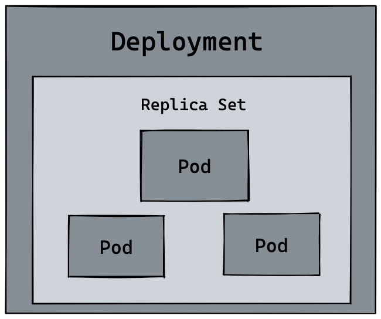
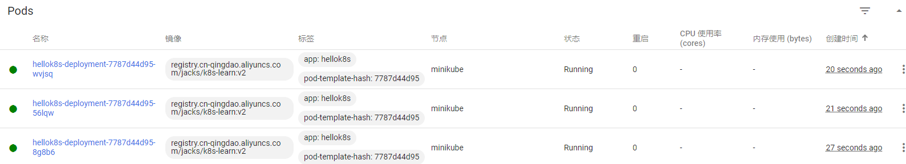
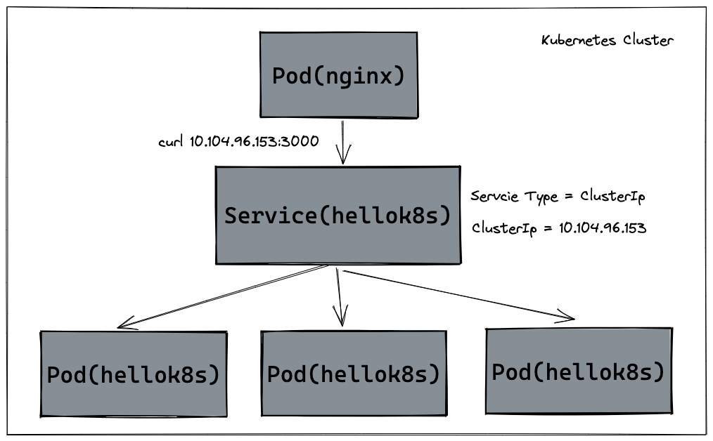
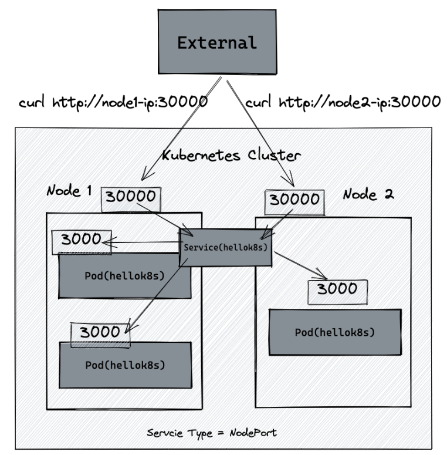
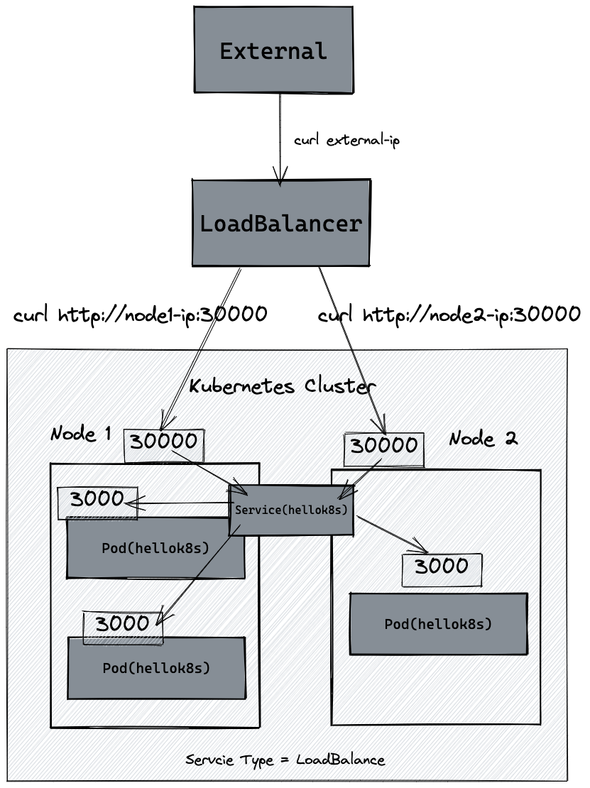

# K8S 入门与实践

## 前言

本文所使用操作系统：`Ubuntu 22.04.1 LTS`物理机

> 另外：本文考虑到了国内网络的特殊性 

前置要求

- 2 CPUs
- 2GB 以上内存
- 20GB 空闲的硬盘
- 通畅的网络
- 容器服务：这里使用[Docker](https://www.docker.com/)


## 安装 minikube

minikube是本地的Kubernetes，专注于使Kubernetes的学习和开发变得简单。

由于没有几台云服务器，或者云服务器的配置不够，亦或者是💴不够升级配置，这时用`minikube`来学习`Kubernets`就再好不过了


#### Linux下安装

```bash
curl -LO https://storage.googleapis.com/minikube/releases/latest/minikube-linux-amd64
sudo install minikube-linux-amd64 /usr/local/bin/minikube
```

#### 安装kubectl

如果不安装的话，后续所有 `kubectl` 相关的命令，使用 `minikube kubectl` 命令替代即可。

```bash
minikube kubectl -- get po -A
```

或者

#####  用 curl 在 Linux 系统中安装 kubectl

1. 用以下命令下载最新发行版：

```
 curl -LO "https://dl.k8s.io/release/$(curl -L -s https://dl.k8s.io/release/stable.txt)/bin/linux/amd64/kubectl"
```

2. 安装 kubectl

```
sudo install -o root -g root -m 0755 kubectl /usr/local/bin/kubectl
```

>**说明：**
>
>即使你没有目标系统的 root 权限，仍然可以将 kubectl 安装到目录 `~/.local/bin` 中：
>
>```bash
>chmod +x kubectl
>mkdir -p ~/.local/bin
>mv ./kubectl ~/.local/bin/kubectl
># 之后将 ~/.local/bin 附加（或前置）到 $PATH
>```

使用如下命令来查看版本的详细信息：

```cmd
kubectl version --client --output=yaml
```


#### 将当前用户添加到docker用户组

```
sudo groupadd docker #添加docker用户组
sudo gpasswd -a $USER docker  #将登陆用户加入到docker用户组中
newgrp docker #更新用户组
```

#### 启动集群

```bash
minikube start --registry-mirror="https://xxxxxx.mirror.aliyuncs.com"
# 注意：你要自己注册阿里云的账号使用自己的镜像源网站，替换掉上面的镜像源网站
# 注册一个阿里云用户,访问 https://cr.console.aliyun.com/#/accelerator 获取专属Docker加速器地址
```

或者

```bash
minikube start --image-mirror-country='cn'
```


#### 打开仪表盘

如果你不想`Minikube` 为你打开 Web 浏览器，可以使用 `--url` 标志运行仪表板命令。 `minikube` 会输出一个 URL，你可以在你喜欢的浏览器中打开该 URL。打开一个终端，然后运行：

```shell
# 启动一个新的终端，并保持此命令运行。
minikube dashboard --url
```


#### **minikube 命令速查**

>`minikube stop` 不会删除任何数据，只是停止 VM 和 k8s 集群。
>
>`minikube delete` 删除所有 minikube 启动后的数据。
>
>`minikube ip` 查看集群和 docker enginer 运行的 IP 地址。
>
>`minikube pause` 暂停当前的资源和 k8s 集群
>
>`minikube status` 查看当前集群状态

## Container

#### 创建一个Container

首先新建一个`main.go`文件，复制下面代码到文件中：

```go
package main

import (
	"io"
	"net/http"
)

func hello(w http.ResponseWriter, r *http.Request) {
	io.WriteString(w, "[v1] Hello, Kubernetes!")
}

func main() {
	http.HandleFunc("/", hello)
	http.ListenAndServe(":3000", nil)
}
```

上面是一串用 [Go](https://go.dev/) 写的代码，代码逻辑非常的简单，首先启动 HTTP 服务器，监听 `3000` 端口，当访问路由 `/`的时候 返回字符串 `[v1] Hello, Kubernetes!`

如果没有任何golang的知识体系和运行环境也没关系，我们是通过容器技术来运行该段代码，接下来编写`Dokerfile`用来构建镜像：

```dockerfile
# Dockerfile
FROM golang:1.20 AS builder
RUN mkdir /src
ADD . /src
WORKDIR /src

RUN go env -w GO111MODULE=auto
RUN CGO_ENABLED=0 GOOS=linux GOARCH=amd64 go build -o /src/app

# 设置时区，未验证
RUN cp /usr/share/zoneinfo/Asia/Shanghai /etc/localtime && echo 'Asia/Shanghai' >/etc/timezone

FROM alpine:3.8

# 配置国内源
RUN echo "http://mirrors.aliyun.com/alpine/v3.8/main/" > /etc/apk/repositories
RUN apk update
RUN apk add ca-certificates
# dns
RUN echo "hosts: files dns" > /etc/nsswitch.conf

WORKDIR /

COPY --from=builder /src/app /
EXPOSE 3000
ENTRYPOINT  ["/app"]
```

> 上面文件大致的意思是首先创建一个拥有golang运行和编译环境的镜像，然后将当前目录下的文件加入到容器中的`/src`文件夹，然后在容器中编译该文件 ，得到可执行文件`main`。然后创建一个`alpine`的镜像，将可执行文件`main`复制到该容器中，并且运行该可执行文件，同时暴露3000端口


```bash
sudo docker build -t k8s-learn:v1.0 .

# [+] Building 27.6s (19/19) FINISHED                                                                           
#  => [internal] load .dockerignore                                                                             
#  => => transferring context: 2B                                                                               
#  => [internal] load build definition from Dockerfile                                                         
#  => => transferring dockerfile: 625B        
# ...

sudo docker images 

# REPOSITORY                                       TAG               IMAGE ID       CREATED          SIZE
# k8s-learn                                        v1.0              2be940055e27   14 minutes ago   12.3MB
```

`docker build` 命令完成后我们可以通过 `docker images` 命令查看镜像是否 build 成功，最后我们执行 `docker run` 命令将容器启动， `-p` 指定 `3000` 作为端口，`-d`表示后台运行，`--name` 指定刚打包成功的镜像名称。

```bash
sudo docker run -d --name hello-k8s -p 3000:3000 k8s-learn:v1.0
```

然后我们用浏览器打开http://127.0.0.1:3000 或者使用curl可以发现一个最简单的容器服务已经构建好了

```bash
$ curl http://127.0.0.1:3000  
[v1] Hello, Kubernetes!
```

#### 将container上传到阿里云容器镜像服务

也可以将镜像上传到`dockerhub`,但是不知为何我的账号登录不了，所以这里使用[阿里云的容器镜像服务](https://cr.console.aliyun.com/cn-qingdao/instances)

创建一个个人实例->创建一个命名空间->创建一个镜像仓库

这里我将这个仓库设置为公有的了，所有有可能看到该教程的小伙伴也能直接使用我的镜像

然后将镜像推送到`阿里云Docker Registry`

```bash
# 登录阿里云Docker Registry
$ docker login --username=[自己的用户名] registry.cn-qingdao.aliyuncs.com
$ docker tag [ImageId] registry.cn-qingdao.aliyuncs.com/[自己的命名空间]/k8s-learn:v1
$ docker push registry.cn-qingdao.aliyuncs.com/[自己的命名空间]/k8s-learn:v1
```


## Pod

#### 新建一个nginx-pod

如果在生产环境中运行的都是独立的单体服务，那么 Container (容器) 也就够用了，但是在实际的生产环境中，维护着大规模的集群和各种不同的服务，服务之间往往存在着各种各样的关系。而这些关系的处理，才是手动管理最困难的地方。

**Pod** 是我们将要创建的第一个 k8s 资源，也是可以在 Kubernetes 中创建和管理的、最小的可部署的计算单元。在了解 `pod` 和 `container` 的区别之前，我们可以先创建一个简单的 pod 试试，

我们先创建 `nginx.yaml` 文件，编写一个可以创建 `nginx` 的 Pod。

```yaml
# nginx.yaml
apiVersion: v1
kind: Pod
metadata:
  name: nginx-pod
spec:
  containers:
    - name: nginx-container
      image: nginx
```

其中 `kind` 表示我们要创建的资源是 `Pod` 类型， `metadata.name` 表示要创建的 pod 的名字，这个名字需要是唯一的。 `spec.containers` 表示要运行的容器的名称和镜像名称。镜像默认来源 `DockerHub`。

我们运行第一条 k8s 命令 `kubectl apply -f nginx.yaml` 命令来创建 `nginx` Pod

接着通过 `kubectl get pods` 来查看 pod 是否正常启动。

最后通过 `kubectl port-forward nginx-pod 4000:80` 命令将 `nginx` 默认的 `80` 端口映射到本机的 `4000` 端口，打开浏览器或者 `curl` 来访问 `http://127.0.0.1:4000` , 查看是否成功访问 `nginx` 默认页面！

```bash
$ kubectl apply -f nginx.yaml
pod/nginx-pod created
$ kubectl get pods
NAME        READY   STATUS              RESTARTS   AGE
nginx-pod   0/1     ContainerCreating   0          6s
$ kubectl get pods
NAME        READY   STATUS    RESTARTS   AGE
nginx-pod   1/1     Running   0          30s
# 注意此时STATUS需要为Running 再执行下面的
$ kubectl port-forward nginx-pod 4000:80
Forwarding from 127.0.0.1:4000 -> 80
Forwarding from [::1]:4000 -> 80
```

`kubectl exec -it` 可以用来进入 Pod 内容器的 Shell。通过命令下面的命令来配置 `nginx` 的首页内容。

```
kubectl exec -it nginx-pod -- /bin/bash

echo "hello kubernetes by nginx!" > /usr/share/nginx/html/index.html

kubectl port-forward nginx-pod 4000:80

$ curl http://127.0.0.1:4000                                                                                  
hello kubernetes by nginx!
```

最后可以通过浏览器或者 `curl` 来访问 `http://127.0.0.1:4000` , 查看是否成功启动 `nginx` 和返回字符串 `hello kubernetes by nginx!`。

#### Pod 与 Container 的不同

回到 `pod` 和 `container` 的区别，我们会发现刚刚创建出来的资源如下图所示，在最内层是我们的服务 `nginx`，运行在 `container` 容器当中， `container` (容器) 的本质是进程，而 `pod` 是管理这一组进程的资源。

[](https://camo.githubusercontent.com/5cf6cf3d7535429968e20836e2e5312bef344257fa62647ba4928129cd4f40a4/68747470733a2f2f63646e2e6a7364656c6976722e6e65742f67682f6775616e677a68656e676c692f50696355524c406d61737465722f755069632f6e67696e785f706f642e706e67)

所以自然 `pod` 可以管理多个 `container`，在某些场景例如服务之间需要文件交换(日志收集)，本地网络通信需求(使用 localhost 或者 Socket 文件进行本地通信)，在这些场景中使用 `pod` 管理多个 `container` 就非常的推荐。而这，也是 k8s 如何处理服务之间复杂关系的第一个例子，如下图所示：

[](https://camo.githubusercontent.com/0c5ac31305f9d3a9bea50e0211b59d3fd033ff9fb5a5b0d70d75bf5dc9ca84c0/68747470733a2f2f63646e2e6a7364656c6976722e6e65742f67682f6775616e677a68656e676c692f50696355524c406d61737465722f755069632f706f642e706e67)

#### Pod 其它命令

我们可以通过 `logs` 或者 `logs -f` 命令查看 pod 日志，可以通过 `exec -it` 进入 pod 或者调用容器命令，通过 `delete pod` 或者 `delete -f nginx.yaml` 的方式删除 pod 资源。这里可以看到 [kubectl 所有命令](https://kubernetes.io/zh-cn/docs/reference/kubectl/)。

```bash
kubectl logs  -f nginx-pod
                              
kubectl exec nginx-pod -- ls

kubectl delete pod nginx-pod
# pod "nginx-pod" deleted

kubectl delete -f nginx.yaml
# pod "nginx-pod" deleted
```

#### 使用自定义的container构建pod

最后，根据我们在 `container` 的那节构建的 `k8s-learn:v1.0` 的镜像，同时参考 `nginx` pod 的资源定义，你能独自编写出 `k8s-learn:v1.0` Pod 的资源文件吗。并通过 `port-forward` 到本地的 `3000` 端口进行访问，最终得到字符串 `[v1] Hello, Kubernetes!`。

`k8s-learn:v1.0` Pod 资源定义和相应的命令如下所示：

```yaml
# hello-k8s.yaml
apiVersion: v1
kind: Pod
metadata:
  name: hellok8s
spec:
  containers:
    - name: hellok8s-container
      image: registry.cn-qingdao.aliyuncs.com/jacks/k8s-learn:v1
```

此时运行`kubectl get pods `可以看到

```bash
NAME        READY   STATUS    RESTARTS   AGE
hello-k8s   1/1     Running   0          82s
nginx-pod   1/1     Running   0          165m
```

于是我们换汤不换药使用`kubectl port-forward hello-k8s 3000:3000`将该pod中的3000端口映射到本机端口

打开一个新的终端运行`curl http://127.0.0.1:3000`，输出`[v1] Hello, Kubernetes!`代表我们已经成功

此时查看我们运行的 [dashboard](http://127.0.0.1:43215/api/v1/namespaces/kubernetes-dashboard/services/http:kubernetes-dashboard:/proxy/#/workloads?namespace=default)


## Deployment

在生产环境中，我们基本上不会直接管理 pod，我们需要 `kubernetes` 来帮助我们来完成一些自动化操作，例如自动扩容或者自动升级版本。可以想象在生产环境中，我们手动部署了 10 个 `hellok8s:v1` 的 pod，这个时候我们需要升级成 `hellok8s:v2` 版本，我们难道需要一个一个的将 `hellok8s:v1` 的 pod 手动升级吗？

这个时候就需要我们来看 `kubernetes` 的另外一个资源 `deployment`，来帮助我们管理 pod。

#### 扩容

首先可以创建一个 `deployment.yaml` 的文件。来管理 `hellok8s` pod。

```yaml
apiVersion: apps/v1
# kind 表示我们要创建的资源是 deployment 类型， metadata.name 表示要创建的 deployment 的名字，这个名字需要是唯一的。
kind: Deployment
metadata:
  name: hellok8s-deployment
spec:
  # replicas 表示的是部署的 pod 副本数量
  replicas: 1
  # selector 里面表示的是 deployment 资源和 pod 资源关联的方式
  selector:
  # 这里表示 deployment 会管理 (selector) 所有 labels=hellok8s 的 pod。
    matchLabels:
      app: hellok8s
  template:
    metadata:
    # 我们需要加上 metadata.labels 来和上面的 selector.matchLabels 对应起来,来表明pod是被deployment管理
      labels:
        app: hellok8s
    spec:
      containers:
        - image: registry.cn-qingdao.aliyuncs.com/jacks/k8s-learn:v1
          name: hellok8s-container
```

之后，我们使用`apply`命令来运行

```bash
kubectl apply -f ./deployment.yaml
```

使用 `get deployments`来查看状态

```bash
$ kubectl get deployments
# NAME                  READY   UP-TO-DATE   AVAILABLE   AGE
# hellok8s-deployment   1/1     1            1           48s
```

此时我们查看`pods`可以发现，该`deployment`自动为我们创建了一个名为`hellok8s-deployment-69b5cc574-xjsgw`的pod

```bash
$ kubectl get pods
# NAME                                  READY   STATUS    RESTARTS   AGE
# hellok8s-deployment-69b5cc574-xjsgw   1/1     Running   0          82s
```

此时我们将该pod删除，则会发现通过`deployment`创建的`pod`和之前我们自己创建的`pod`的本质区别：

```bash
$ kubectl delete pod hellok8s-deployment-69b5cc574-xjsgw
# pod "hellok8s-deployment-69b5cc574-xjsgw" deleted
$ kubectl get pods
# NAME                                  READY   STATUS    RESTARTS   AGE
# hellok8s-deployment-69b5cc574-mdrsw   1/1     Running   0          3s
```

在我们删除之后，deployment自动又创建了 一个新的pod，这代表着当生产环境管理着成千上万个 pod 时，我们不需要关心具体的情况，只需要维护好这份 `deployment.yaml` 文件的资源定义即可。

接下来我们通过自动扩容来加深这个知识点，当我们想要将 `hellok8s:v1` 的资源扩容到 3 个副本时，只需要**将`yaml`文件中的 `replicas` 的值设置成 3**，接着重新输入 `kubectl apply -f deployment.yaml` 即可。此时我们可以通过`kubectl get pods --watch`命令或者`dashboard`来观察 pod 启动和删除的记录，想要减少副本数时也很简单，你可以尝试将副本数随意增大或者缩小，再通过 `watch` 来观察它的状态。


[](https://camo.githubusercontent.com/86dc51b4f9f2e0cbfed2cf7ac41e48578b0005c280d18c6a4d3930a9d4f95880/68747470733a2f2f63646e2e6a7364656c6976722e6e65742f67682f6775616e677a68656e676c692f50696355524c406d61737465722f755069632f6465706c6f796d656e742e706e67)

#### 升级版本

##### 方法一（修改配置文件重新`apply`）

我们接下来尝试将所有 `v1` 版本的 `pod` 升级到 `v2` 版本。首先我们需要构建一份 `hellok8s:v2` 的版本镜像。唯一的区别就是字符串替换成了 `[v2] Hello, Kubernetes!`。

```go
package main

import (
	"io"
	"net/http"
)

func hello(w http.ResponseWriter, r *http.Request) {
	io.WriteString(w, "[v2] Hello, Kubernetes!")
}

func main() {
	http.HandleFunc("/", hello)
	http.ListenAndServe(":3000", nil)
}
```

于是我们重新build，并且`push`到阿里云镜像

```bash
sudo docker build -t k8s-learn:v2.0 .
sudo docker tag [ImageId] registry.cn-qingdao.aliyuncs.com/[自己的命名空间]/k8s-learn:v2
sudo docker push registry.cn-qingdao.aliyuncs.com/[自己的命名空间]/k8s-learn:v2
```

接着我们编写`v2`版本的 deployment 资源文件`deployment -v2.yaml`。

```yaml
# deployment-v2.yaml
apiVersion: apps/v1
kind: Deployment
metadata:
  name: hellok8s-deployment
spec:
  replicas: 3
  selector:
    matchLabels:
      app: hellok8s
  template:
    metadata:
      labels:
        app: hellok8s
    spec:
      containers:
        - image: registry.cn-qingdao.aliyuncs.com/jacks/k8s-learn:v2
          name: hellok8s-container
```

然后重新`apply v2`版本的`deployment`

##### 方法二：

使用以下命令：

```bash
kubectl set image deployment.v1.apps/hellok8s-deployment hellok8s-container=registry.cn-qingdao.aliyuncs.com/jacks/k8s-learn:v2
```

或者：

```bash
kubectl set image deployment/hellok8s-deployment hellok8s-container=registry.cn-qingdao.aliyuncs.com/jacks/k8s-learn:v2
```


获取 Deployment 的更多信息

```bash
kubectl describe deployments
```

输出类似于：

```
Name:                   hellok8s-deployment
Namespace:              default
CreationTimestamp:      Wed, 14 Jun 2023 10:19:11 +0800
Labels:                 <none>
Annotations:            deployment.kubernetes.io/revision: 4
Selector:               app=hellok8s
Replicas:               3 desired | 3 updated | 3 total | 3 available | 0 unavailable
StrategyType:           RollingUpdate
MinReadySeconds:        0
RollingUpdateStrategy:  25% max unavailable, 25% max surge
Pod Template:
  Labels:  app=hellok8s
  Containers:
   hellok8s-container:
    Image:        registry.cn-qingdao.aliyuncs.com/jacks/k8s-learn:v2
    Port:         <none>
    Host Port:    <none>
    Environment:  <none>
    Mounts:       <none>
  Volumes:        <none>
Conditions:
  Type           Status  Reason
  ----           ------  ------
  Available      True    MinimumReplicasAvailable
  Progressing    True    NewReplicaSetAvailable
OldReplicaSets:  hellok8s-deployment-69b5cc574 (0/0 replicas created)
NewReplicaSet:   hellok8s-deployment-7787d44d95 (3/3 replicas created)
Events:
  Type    Reason             Age                From                   Message
  ----    ------             ----               ----                   -------
  Normal  ScalingReplicaSet  33m                deployment-controller  Scaled up replica set hellok8s-deployment-7787d44d95 to 1 from 0
...
```


不到一会，可以看到`v1`版本的镜像都统一换成了`v2`版本



你也可以输入 `kubectl describe pod [pod name]` 来看是否是 `v2 `版本的镜像。

#### 检查 Deployment 上线历史

我们先检查`deployment`修订历史

```bash
kubectl rollout history deployment/hellok8s-deployment
```

输出类似：

```
deployment.apps/hellok8s-deployment 
REVISION  CHANGE-CAUSE
3         <none>
4         <none>
```

查看某一版本的详细历史


```
kubectl rollout history deployment/hellok8s-deployment --revision=3
```

输出：

```
deployment.apps/hellok8s-deployment with revision #3
Pod Template:
  Labels:       app=hellok8s
        pod-template-hash=69b5cc574
  Containers:
   hellok8s-container:
    Image:      registry.cn-qingdao.aliyuncs.com/jacks/k8s-learn:v1
    Port:       <none>
    Host Port:  <none>
    Environment:        <none>
    Mounts:     <none>
  Volumes:      <none>
```

可以看到vision为3时的Image是v1版本

#### 回滚 Deployment之前的修订版本

假定现在你已决定撤消当前上线并回滚到以前的修订版本：

```bash
kubectl rollout undo deployment/hellok8s-deployment
```

输出类似：

`deployment.apps/hellok8s-deployment rolled back`

或者，你也可以通过使用 `--to-revision` 来回滚到特定修订版本：

```bash
kubectl rollout undo deployment/hellok8s-deployment --to-revision=3
```

在这里我们先将当前Image 版本回滚到v1版本，为了下一节滚动更新的效果

#### Rolling Update(滚动更新)

如果我们在生产环境上，管理着多个副本的 `hellok8s:v1` 版本的 pod，我们需要更新到 `v2` 的版本，像上面那样的部署方式是可以的，但是也会带来一个问题，就是所有的副本在同一时间更新，这会导致我们 `hellok8s` 服务在短时间内是不可用的，因为所有 pod 都在升级到 `v2` 版本的过程中，需要等待某个 pod 升级完成后才能提供服务。

这个时候我们就需要滚动更新 (rolling update)，在保证新版本 `v2` 的 pod 还没有 `ready` 之前，先不删除 `v1` 版本的 pod。

在 deployment 的资源定义中, `spec.strategy.type` 有两种选择:

- **`RollingUpdate:`** 逐渐增加新版本的 pod，逐渐减少旧版本的 pod。
- **`Recreate:`** 在新版本的 pod 增加前，先将所有旧版本 pod 删除。

大多数情况下我们会采用滚动更新 (Rolling Update) 的方式，滚动更新又可以通过 `maxSurge` 和 `maxUnavailable` 字段来控制升级 pod 的速率，具体可以详细看[官网定义](https://kubernetes.io/zh-cn/docs/concepts/workloads/controllers/deployment/)。：

- [**maxSurge:**](https://kubernetes.io/docs/concepts/workloads/controllers/deployment/#max-surge) 最大峰值，用来指定可以创建的超出期望 Pod 个数的 Pod 数量，可以是一个绝对数字，也可是所需pod的百分比如20%
- [**maxUnavailable:**](https://kubernetes.io/docs/concepts/workloads/controllers/deployment/#max-unavailable,) 最大不可用，用来指定更新过程中不可用的 Pod 的个数上限，可以是一个绝对数字，也可是所需pod的百分比如20%。

接着设置 `strategy=rollingUpdate` , `maxSurge=1` , `maxUnavailable=1` 和 `replicas=3` 到 deployment.yaml 文件中。这个参数配置意味着最大可能会创建 4 个 hellok8s pod (replicas + maxSurge)，最小会有 2 个 hellok8s pod 存活 (replicas - maxUnavailable)。

```yaml
# deployment.yaml
apiVersion: apps/v1
kind: Deployment
metadata:
  name: hellok8s-deployment
spec:
  strategy:
     rollingUpdate:
      maxSurge: 1
      maxUnavailable: 1
  replicas: 3
  selector:
    matchLabels:
      app: hellok8s
  template:
    metadata:
      labels:
        app: hellok8s
    spec:
      containers:
        - image: registry.cn-qingdao.aliyuncs.com/jacks/k8s-learn:v2
          name: hellok8s-container
```

使用 `kubectl apply -f deployment.yaml` 来重新创建 `v2` 的资源，可以通过 `kubectl get pods --watch` 来观察 pod 的创建销毁情况，是否如下图所示。

[](https://camo.githubusercontent.com/526eeefe7af67cd567486657693e9acac102f726f5b69427b3796bd0c3ff17be/68747470733a2f2f63646e2e6a7364656c6976722e6e65742f67682f6775616e677a68656e676c692f50696355524c406d61737465722f755069632f726f6c6c696e677570646174652e706e67)

### 存活探针 (livenessProb)

>存活探测器来确定什么时候要重启容器。 例如，存活探测器可以探测到应用死锁（应用程序在运行，但是无法继续执行后面的步骤）情况。 重启这种状态下的容器有助于提高应用的可用性，即使其中存在缺陷。-- [LivenessProb](https://kubernetes.io/docs/tasks/configure-pod-container/configure-liveness-readiness-startup-probes/)

在生产中，有时候因为某些 bug 导致应用死锁或者线程耗尽了，最终会导致应用无法继续提供服务，这个时候如果没有手段来自动监控和处理这一问题的话，可能会导致很长一段时间无人发现。[kubelet](https://kubernetes.io/docs/reference/command-line-tools-reference/kubelet/) 使用存活探测器 (livenessProb) 来确定什么时候要重启容器。

接下来我们写一个 `/healthz` 接口来说明 `livenessProb` 如何使用。 `/healthz` 接口会在启动成功的 15s 内正常返回 200 状态码，在 15s 后，会一直返回 500 的状态码。

```go
package main

import (
	"fmt"
	"io"
	"net/http"
	"time"
)

func hello(w http.ResponseWriter, r *http.Request) {
	io.WriteString(w, "[v2] Hello, Kubernetes!")
}

func main() {
	started := time.Now()
	http.HandleFunc("/healthz", func(w http.ResponseWriter, r *http.Request) {
		duration := time.Since(started)
		if duration.Seconds() > 15 {
			w.WriteHeader(500)
			w.Write([]byte(fmt.Sprintf("error: %v", duration.Seconds())))
		} else {
			w.WriteHeader(200)
			w.Write([]byte("ok"))
		}
	})

	http.HandleFunc("/", hello)
	http.ListenAndServe(":3000", nil)
}
```

然后我使用原先的`Dockerfile`们重新build，把tag修改为`liveness`并推送到远程仓库

```bash
sudo docker build  -t registry.cn-qingdao.aliyuncs.com/[自己的命名空间]/k8s-learn:liveness .
sudo docker push  registry.cn-qingdao.aliyuncs.com/jacks/[自己的命名空间]:liveness
```

最后我们重新编辑deployment定义，我在v2版本上做出修改，添加存活探针，我们新建文件`deployment-livenessProbe.yaml`

```yaml
# deployment-livenessProbe.yaml
apiVersion: apps/v1
kind: Deployment
metadata:
  name: hellok8s-deployment
spec:
  strategy:
     rollingUpdate:
      maxSurge: 1
      maxUnavailable: 1
  replicas: 3
  selector:
    matchLabels:
      app: hellok8s
  template:
    metadata:
      labels:
        app: hellok8s
    spec:
      containers:
        - image: registry.cn-qingdao.aliyuncs.com/jacks/k8s-learn:liveness
          name: hellok8s-container
          livenessProbe:
            httpGet:
              path: /healthz
              port: 3000
            initialDelaySeconds: 3
            periodSeconds: 3
```

这里我们使用存活探针的方式是通过HTTP指定port和命名；请求的是刚才定义的 `/healthz` 接口，`periodSeconds` 字段指定了 kubelet 每隔 3 秒执行一次存活探测。 `initialDelaySeconds` 字段告诉 `kubelet` 在执行第一次探测前应该等待 3 秒。如果服务器上 `/healthz` 路径下的处理程序返回成功代码，则 `kubelet` 认为容器是健康存活的。 如果处理程序返回失败代码，则 `kubelet` 会杀死这个容器并将其重启。

过一定的时间使用`get pods`命令可以发现，每个pods都重启了好几次

```bash
$ kubectl get pods
NAME                                READY   STATUS    RESTARTS      AGE
hellok8s-deployment-654c64d-gsrtj   1/1     Running   3 (1s ago)    76s
hellok8s-deployment-654c64d-mg7dz   1/1     Running   2 (22s ago)   70s
hellok8s-deployment-654c64d-rwxxr   1/1     Running   3 (1s ago)    76s
```

同样的使用`cmd` ,`tpc socket` ,`grpc`可能做存活指针的触发条件

### 就绪探针 (readiness)

> 有时候，应用会暂时性地无法为请求提供服务。 例如，应用在启动时可能需要加载大量的数据或配置文件，或是启动后要依赖等待外部服务。 在这种情况下，既不想杀死应用，也不想给它发送请求。 Kubernetes 提供了就绪探针来发现并缓解这些情况。 容器所在 Pod 上报还未就绪的信息，并且不接受通过 Kubernetes Service 的流量。

在生产环境中，升级服务的版本是日常的需求，这时我们需要考虑一种场景，即当发布的版本存在问题，就不应该让它升级成功。`kubelet` 使用就绪探测器可以知道容器何时准备好接受请求流量，当一个 pod 升级后不能就绪，即不应该让流量进入该 pod，在配合 `rollingUpate` 的功能下，也不能允许升级版本继续下去，否则服务会出现全部升级完成，导致所有服务均不可用的情况。

我们先将版本回滚到v2版本，以确保后续的实验进行

```
kubectl rollout undo deployment/hellok8s-deployment
```

如何我们重新修改`golang`代码，将 `/healthz` 接口直接设置成返回 500 状态码，代表该版本是一个有问题的版本。

```go
package main

import (
	"io"
	"net/http"
)

func hello(w http.ResponseWriter, r *http.Request) {
	io.WriteString(w, "[v2] Hello, Kubernetes!")
}

func main() {
	http.HandleFunc("/healthz", func(w http.ResponseWriter, r *http.Request) {
		w.WriteHeader(500)
	})

	http.HandleFunc("/", hello)
	http.ListenAndServe(":3000", nil)
}
```

重新build然后tag为bad上传

```
sudo docker build  -t registry.cn-qingdao.aliyuncs.com/jacks/k8s-learn:bad .
sudo docker push  registry.cn-qingdao.aliyuncs.com/jacks/k8s-learn:bad
```

接着编写 deployment 资源文件，[Probe](https://kubernetes.io/docs/reference/generated/kubernetes-api/v1.25/#probe-v1-core) 有很多配置字段，可以使用这些字段精确地控制就绪检测的行为：

- `initialDelaySeconds`：容器启动后要等待多少秒后才启动存活和就绪探测器， 默认是 0 秒，最小值是 0。
- `periodSeconds`：执行探测的时间间隔（单位是秒）。默认是 10 秒。最小值是 1。
- `timeoutSeconds`：探测的超时后等待多少秒。默认值是 1 秒。最小值是 1。
- `successThreshold`：探测器在失败后，被视为成功的最小连续成功数。默认值是 1。 存活和启动探测的这个值必须是 1。最小值是 1。
- `failureThreshold`：当探测失败时，Kubernetes 的重试次数。 对存活探测而言，放弃就意味着重新启动容器。 对就绪探测而言，放弃意味着 Pod 会被打上未就绪的标签。默认值是 3。最小值是 1。

```yaml
apiVersion: apps/v1
kind: Deployment
metadata:
  name: hellok8s-deployment
spec:
  strategy:
     rollingUpdate:
      maxSurge: 1
      maxUnavailable: 1
  replicas: 3
  selector:
    matchLabels:
      app: hellok8s
  template:
    metadata:
      labels:
        app: hellok8s
    spec:
      containers:
        - image: guangzhengli/hellok8s:bad
          name: hellok8s-container
          readinessProbe:
            httpGet:
              path: /healthz
              port: 3000
            initialDelaySeconds: 1
            successThreshold: 5
```

通过 `get` 命令可以发现两个 pod 一直处于还没有 Ready 的状态当中，通过 `describe` 命令可以看到是因为 `Readiness probe failed: HTTP probe failed with statuscode: 500` 的原因。又因为设置了最小不可用的服务数量为`maxUnavailable=1`，这样能保证剩下两个 `v2` 版本的 `hellok8s` 能继续提供服务！

## Service

经过前面几节的练习，可能你会有一些疑惑：

- 为什么 pod 不就绪 (Ready) 的话，`kubernetes` 不会将流量重定向到该 pod，这是怎么做到的？
- 前面访问服务的方式是通过 `port-forword` 将 pod 的端口暴露到本地，不仅需要写对 pod 的名字，一旦 deployment 重新创建新的 pod，pod 名字和 IP 地址也会随之变化，如何保证稳定的访问地址呢？。
- 如果使用 deployment 部署了多个 Pod 副本，如何做负载均衡呢？

`kubernetes` 提供了一种名叫 `Service` 的资源帮助解决这些问题，它为 pod 提供一个稳定的 Endpoint。Service 位于 pod 的前面，负责接收请求并将它们传递给它后面的所有pod。一旦服务中的 Pod 集合发生更改，Endpoints 就会被更新，请求的重定向自然也会导向最新的 pod。

### ClusterIP

`ClusterIP`是通过**集群的内部 IP 暴露服务**，选择该值，服务只能够在集群内部可以访问，这也是**默认的Service类型**。`ClusterIP`类型的service创建时，k8s会通过`etcd`从可分配的IP池中分配一个IP，该IP全局唯一，且不可修改。所有访问该IP的请求，都会被iptables转发到后端的endpoints中。

首先做一些准备工作，在之前的 `hellok8s:v2` 版本上加上返回当前服务所在的 `hostname` 功能，升级到 `v3` 版本。

```go
package main

import (
	"fmt"
	"io"
	"net/http"
	"os"
)

func hello(w http.ResponseWriter, r *http.Request) {
	host, _ := os.Hostname()
	io.WriteString(w, fmt.Sprintf("[v3] Hello, Kubernetes!, From host: %s", host))
}

func main() {
	http.HandleFunc("/", hello)
	http.ListenAndServe(":3000", nil)
}
```

同样的将v3版本的镜像push到云端，然后我们编写v3的 deployment 的 `hellok8s` 为 `v3` 版本。并且执行 `kubectl apply -f deployment.yaml` 更新 deployment。

```yaml
# deployment-v3.yaml
apiVersion: apps/v1
kind: Deployment
metadata:
  name: hellok8s-deployment
spec:
  replicas: 3
  selector:
    matchLabels:
      app: hellok8s
  template:
    metadata:
      labels:
        app: hellok8s
    spec:
      containers:
        - image: registry.cn-qingdao.aliyuncs.com/jacks/k8s-learn:v3
          name: hellok8s-container
```

接下来是 `Service` 资源的定义，我们使用 `ClusterIP` 的方式定义 Service，通过 `kubernetes` 集群的内部 IP 暴露服务，当我们只需要让集群中运行的其他应用程序访问我们的 pod 时，就可以使用这种类型的Service。首先创建一个 `service-hellok8s-clusterip.yaml` 文件。

```yaml
apiVersion: v1
kind: Service
metadata:
  name: service-hellok8s-clusterip
spec:
  type: ClusterIP
  selector:
    app: hellok8s
  ports:
  - port: 3000
    targetPort: 3000
```

首先通过 `kubectl get endpoints` 来看看 Endpoint。被 selector 选中的 Pod，就称为 Service 的 Endpoints。它维护着 Pod 的 IP 地址，只要服务中的 Pod 集合发生更改，Endpoints 就会被更新。通过 `kubectl get pod -o wide` 命令获取 Pod 更多的信息，可以看到 3 个 Pod 的 IP 地址和 Endpoints 中是保持一致的，你可以试试增大或减少 Deployment 中 Pod 的 replicas，观察 Endpoints 会不会发生变化。

```bash
$ kubectl apply -f service-hellok8s-clusterip.yaml

$ kubectl get endpoints
# NAME                         ENDPOINTS                                          AGE
# service-hellok8s-clusterip   172.17.0.10:3000,172.17.0.2:3000,172.17.0.3:3000   10s

$ kubectl get pod -o wide                                                                                       
NAME                                  READY   STATUS    RESTARTS   AGE     IP            NODE    
hellok8s-deployment-f89d49976-6rswv   1/1     Running   0          5m7s    10.244.0.39   minikube 
hellok8s-deployment-f89d49976-ftkw2   1/1     Running   0          5m8s    10.244.0.38   minikube 
hellok8s-deployment-f89d49976-msbvt   1/1     Running   0          5m11s   10.244.0.37   minikube  

$ kubectl get service                                                                                           
NAME                         TYPE        CLUSTER-IP     EXTERNAL-IP   PORT(S)    AGE
service-hellok8s-clusterip   ClusterIP   10.97.20.175   <none>        3000/TCP   42s
```

接着我们可以通过在集群其它应用中访问 `service-hellok8s-clusterip` 的 IP 地址 `10.97.20.175` 来访问 `hellok8s:v3` 服务。

这里通过在集群内创建一个 `nginx` 来访问 `hellok8s` 服务。创建后进入 `nginx` 容器来用 `curl` 命令访问 `service-hellok8s-clusterip` 。

```yaml
apiVersion: v1
kind: Pod
metadata:
  name: nginx
  labels:
    app: nginx
spec:
  containers:
    - name: nginx-container
      image: nginx
```

```yaml
kubectl get pods
# NAME                                   READY   STATUS    RESTARTS   AGE
# hellok8s-deployment-5d5545b69c-24lw5   1/1     Running   0          27m
# hellok8s-deployment-5d5545b69c-9g94t   1/1     Running   0          27m
# hellok8s-deployment-5d5545b69c-9gm8r   1/1     Running   0          27m
# nginx                                  1/1     Running   0          41m

kubectl get service
# NAME                         TYPE        CLUSTER-IP      EXTERNAL-IP   PORT(S)    AGE
# service-hellok8s-clusterip   ClusterIP   10.104.96.153   <none>        3000/TCP   10s

kubectl exec -it nginx-pod /bin/bash
# root@nginx-pod:/# curl 10.104.96.153:3000
# [v3] Hello, Kubernetes!, From host: hellok8s-deployment-5d5545b69c-9gm8r
# root@nginx-pod:/# curl 10.104.96.153:3000
#[v3] Hello, Kubernetes!, From host: hellok8s-deployment-5d5545b69c-9g94t
```

可以看到，我们多次 `curl 10.104.96.153:3000` 访问 `hellok8s` Service IP 地址，返回的 `hellok8s:v3` `hostname` 不一样，说明 Service 可以接收请求并将它们传递给它后面的所有 pod，还可以自动负载均衡。你也可以试试增加或者减少 `hellok8s:v3` pod 副本数量，观察 Service 的请求是否会动态变更。调用过程如下图所示：

[](https://camo.githubusercontent.com/fc482afac9762c7a6f0edd2a22b0c4aaaff67af00d1cda1c48a3bea1afc586a0/68747470733a2f2f63646e2e6a7364656c6976722e6e65742f67682f6775616e677a68656e676c692f50696355524c406d61737465722f755069632f736572766963652d636c757374657269702d6669782d6e616d652e706e67)

除了上述的 `ClusterIp` 的方式外，Kubernetes `ServiceTypes` 允许指定你所需要的 Service 类型，默认是 `ClusterIP`。`Type` 的值包括如下：

- `ClusterIP`：通过**集群的内部 IP 暴露服务**，选择该值时服务**只能够在集群内部访问**。 这也是**默认的 `ServiceType**`。

- [`NodePort`](https://kubernetes.io/docs/concepts/services-networking/service/#type-nodeport)：通过每个节点上的 **IP 和静态端口**（`NodePort`）**暴露**服务。 `NodePort` 服务会路由到自动创建的 `ClusterIP` 服务。 通过请求 `<节点 IP>:<节点端口>`，你**可以从集群的外部访问一个 `NodePort` 服务**。

- [`LoadBalancer`](https://kubernetes.io/docs/concepts/services-networking/service/#loadbalancer)：使用**云提供商**的负载均衡器向外部暴露服务。 外部负载均衡器可以将流量路由到自动创建的 `NodePort` 服务和 `ClusterIP` 服务上。

- [`ExternalName`](https://kubernetes.io/docs/concepts/services-networking/service/#externalname)：通过返回 `CNAME` 和对应值，可以将服务映射到 `externalName` 字段的内容（例如，`foo.bar.example.com`）。 无需创建任何类型代理。

  ### NodePort

    我们知道`kubernetes` 集群并不是单机运行，它管理着多台节点即 [Node](https://kubernetes.io/docs/concepts/architecture/nodes/)，可以通过每个节点上的 IP 和静态端口（`NodePort`）暴露服务。如下图所示，如果集群内有两台 Node 运行着 `hellok8s:v3`，我们创建一个 `NodePort` 类型的 Service，将 `hellok8s:v3` 的 `3000` 端口映射到 Node 机器的 `30000` 端口 (在 30000-32767 范围内)，就可以通过访问 `http://node1-ip:30000` 或者 `http://node2-ip:30000` 访问到服务。



  这里以 `minikube` 为例，我们可以通过 `minikube ip` 命令拿到 k8s cluster node IP地址。下面的教程都以我本机的 `192.168.59.100` 为例，需要替换成你的 IP 地址。

  ```
  minikube ip
  # 192.168.59.100
  ```

  接着以 NodePort 的 ServiceType 创建一个 Service 来接管 pod 流量。通过`minikube` 节点上的 IP `192.168.59.100` 暴露服务。 `NodePort` 服务会路由到自动创建的 `ClusterIP` 服务。 通过请求 `<节点 IP>:<节点端口>` -- `192.168.59.100`:30000，你可以从集群的外部访问一个 `NodePort` 服务，最终重定向到 `hellok8s:v3` 的 `3000` 端口。

  ```yaml
  apiVersion: v1
  kind: Service
  metadata:
    name: service-hellok8s-nodeport
  spec:
    type: NodePort
    selector:
      app: hellok8s
    ports:
    - port: 3000
      nodePort: 30000
  ```

  创建 `service-hellok8s-nodeport` Service 后，使用 `curl` 命令或者浏览器访问 `http://192.168.59.100:30000` 可以得到结果。

### LoadBalancer

[`LoadBalancer`](https://kubernetes.io/docs/concepts/services-networking/service/#loadbalancer) 是使用云提供商的负载均衡器向外部暴露服务。 外部负载均衡器可以将流量路由到自动创建的 `NodePort` 服务和 `ClusterIP` 服务上，假如你在 [AWS](https://aws.amazon.com/) 的 [EKS](https://aws.amazon.com/eks/) 集群上创建一个 Type 为 `LoadBalancer` 的 Service。它会自动创建一个 ELB ([Elastic Load Balancer](https://aws.amazon.com/elasticloadbalancing)) ，并可以根据配置的 IP 池中自动分配一个独立的 IP 地址，可以供外部访问。

这里因为我们使用的是 `minikube`，可以使用 `minikube tunnel` 来辅助创建 LoadBalancer 的 `EXTERNAL_IP`，具体教程可以查看[官网文档](https://minikube.sigs.k8s.io/docs/handbook/accessing/#loadbalancer-access)，但是和实际云提供商的 LoadBalancer 还是有本质区别，所以 [Repository](https://github.com/guangzhengli/kubernetes_workshop) 不做更多阐述，有条件的可以使用 [AWS](https://aws.amazon.com/) 的 [EKS](https://aws.amazon.com/eks/) 集群上创建一个 ELB ([Elastic Load Balancer](https://aws.amazon.com/elasticloadbalancing)) 试试。

下图显示 LoadBalancer 的 Service 架构图。



## ingress

[Ingress](https://kubernetes.io/docs/reference/generated/kubernetes-api/v1.25/#ingress-v1beta1-networking-k8s-io) **公开从集群外部到集群内[服务](https://kubernetes.io/docs/concepts/services-networking/service/)**的 HTTP 和 HTTPS 路由。 流量路由由 Ingress 资源上定义的规则控制。Ingress 可为 Service 提供外部可访问的 URL、负载均衡流量、 SSL/TLS，以及基于名称的虚拟托管。你必须拥有一个 [Ingress 控制器](https://kubernetes.io/zh-cn/docs/concepts/services-networking/ingress-controllers) 才能满足 Ingress 的要求。 仅创建 Ingress 资源本身没有任何效果。 [Ingress 控制器](https://kubernetes.io/docs/concepts/services-networking/ingress-controllers) 通常负责通过负载均衡器来实现 Ingress，例如 `minikube` 默认使用的是 [nginx-ingress](https://minikube.sigs.k8s.io/docs/tutorials/nginx_tcp_udp_ingress/)，目前 `minikube` 也支持 [Kong-Ingress](https://minikube.sigs.k8s.io/docs/handbook/addons/kong-ingress/)。

Ingress 可以“简单理解”为服务的网关 Gateway，它是所有流量的入口，经过配置的路由规则，将流量重定向到后端的服务。

在 `minikube` 中，可以通过下面命令开启 Ingress-Controller 的功能。默认使用的是 [nginx-ingress](https://minikube.sigs.k8s.io/docs/tutorials/nginx_tcp_udp_ingress/)。

```
minikube addons enable ingress
```

接着删除之前创建的所有 `pod`, `deployment`, `service` 资源。

```
kubectl delete deployment,service --all
```

接着根据之前的教程，创建 `hellok8s:v3` 和 `nginx` 的`deployment`与 `service` 资源。Service 的 type 为 ClusterIP 即可。

`hellok8s:v3` 的端口映射为 `3000:3000`，`nginx` 的端口映射为 `4000:80`，这里后续写 Ingress Route 规则时会用到。


## 其他

#### Ubuntu 22.04.1 LTS 安装kubeadm、kubelet、kubectl

```bash
curl https://mirrors.aliyun.com/kubernetes/apt/doc/apt-key.gpg | sudo apt-key add -

sudo apt-get update

# Enable kernel modules
sudo tee /etc/modules-load.d/containerd.conf <<EOF
overlay
br_netfilter
EOF
sudo modprobe overlay
sudo modprobe br_netfilter

# Add some settings to sysctl
sudo tee /etc/sysctl.d/kubernetes.conf<<EOF
net.bridge.bridge-nf-call-ip6tables = 1
net.bridge.bridge-nf-call-iptables = 1
net.ipv4.ip_forward = 1
EOF

# 重新加载 sysctl
sudo sysctl --system


sudo curl -fsSL https://download.docker.com/linux/ubuntu/gpg | sudo gpg --dearmour -o /etc/apt/trusted.gpg.d/docker.gpg
sudo add-apt-repository "deb [arch=amd64] https://download.docker.com/linux/ubuntu $(lsb_release -cs) stable"


#  安装GPG证书
sudo curl -fsSL https://mirrors.aliyun.com/docker-ce/linux/ubuntu/gpg | sudo gpg --dearmour -o /etc/apt/trusted.gpg.d/docker.gpg
sudo add-apt-repository "deb [arch=amd64] https://mirrors.aliyun.com/docker-ce/linux/ubuntu $(lsb_release -cs) stable"

```


## 参考资料

[kubernetes tutorials](https://github.com/guangzhengli/k8s-tutorials#%E5%AE%89%E8%A3%85-kubectl)

[k8s官网](https://kubernetes.io/zh-cn/docs/tutorials/hello-minikube/)