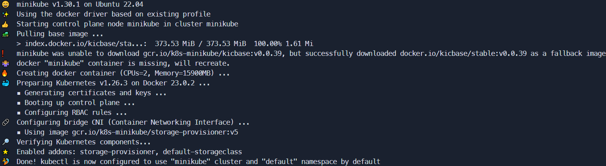
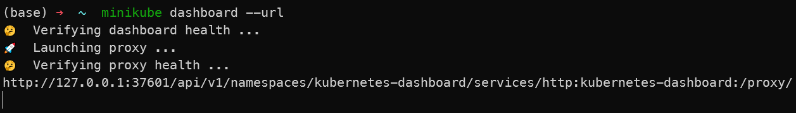
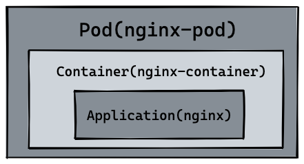
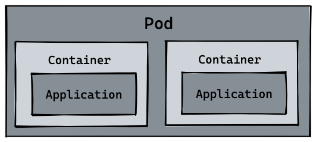
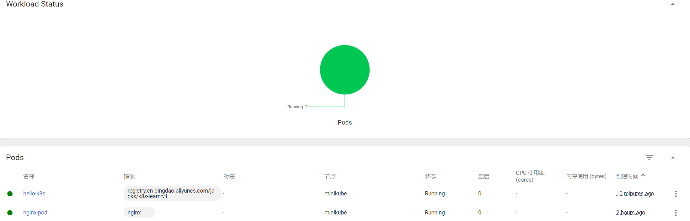

# K8S 入门与实践

## 前言

本文所使用操作系统：`Ubuntu 22.04.1 LTS`物理机

> 另外：本文考虑到了国内网络的特殊性 

前置要求

- 2 CPUs
- 2GB 以上内存
- 20GB 空闲的硬盘
- 通畅的网络
- 容器服务：这里使用[Docker](https://www.docker.com/)


## 安装 minikube

minikube是本地的Kubernetes，专注于使Kubernetes的学习和开发变得简单。

由于没有几台云服务器，或者云服务器的配置不够，亦或者是💴不够升级配置，这时用`minikube`来学习`Kubernets`就再好不过了


#### Linux下安装

```bash
curl -LO https://storage.googleapis.com/minikube/releases/latest/minikube-linux-amd64
sudo install minikube-linux-amd64 /usr/local/bin/minikube
```

#### 安装kubectl

如果不安装的话，后续所有 `kubectl` 相关的命令，使用 `minikube kubectl` 命令替代即可。

```bash
minikube kubectl -- get po -A
```

或者

#####  用 curl 在 Linux 系统中安装 kubectl

1. 用以下命令下载最新发行版：

```
 curl -LO "https://dl.k8s.io/release/$(curl -L -s https://dl.k8s.io/release/stable.txt)/bin/linux/amd64/kubectl"
```

2. 安装 kubectl

```
sudo install -o root -g root -m 0755 kubectl /usr/local/bin/kubectl
```

>**说明：**
>
>即使你没有目标系统的 root 权限，仍然可以将 kubectl 安装到目录 `~/.local/bin` 中：
>
>```bash
>chmod +x kubectl
>mkdir -p ~/.local/bin
>mv ./kubectl ~/.local/bin/kubectl
># 之后将 ~/.local/bin 附加（或前置）到 $PATH
>```

使用如下命令来查看版本的详细信息：

```cmd
kubectl version --client --output=yaml
```


#### 将当前用户添加到docker用户组

```
sudo groupadd docker #添加docker用户组
sudo gpasswd -a $USER docker  #将登陆用户加入到docker用户组中
newgrp docker #更新用户组
```

#### 启动集群

```bash
minikube start --registry-mirror="https://xxxxxx.mirror.aliyuncs.com"
# 注意：你要自己注册阿里云的账号使用自己的镜像源网站，替换掉上面的镜像源网站
# 注册一个阿里云用户,访问 https://cr.console.aliyun.com/#/accelerator 获取专属Docker加速器地址
```

或者

```bash
minikube start --image-mirror-country='cn'
```




#### 打开仪表盘

如果你不想`Minikube` 为你打开 Web 浏览器，可以使用 `--url` 标志运行仪表板命令。 `minikube` 会输出一个 URL，你可以在你喜欢的浏览器中打开该 URL。打开一个终端，然后运行：

```shell
# 启动一个新的终端，并保持此命令运行。
minikube dashboard --url
```



#### **minikube 命令速查**

>`minikube stop` 不会删除任何数据，只是停止 VM 和 k8s 集群。
>
>`minikube delete` 删除所有 minikube 启动后的数据。
>
>`minikube ip` 查看集群和 docker enginer 运行的 IP 地址。
>
>`minikube pause` 暂停当前的资源和 k8s 集群
>
>`minikube status` 查看当前集群状态

## Container

#### 创建一个Container

首先新建一个`main.go`文件，复制下面代码到文件中：

```go
package main

import (
	"io"
	"net/http"
)

func hello(w http.ResponseWriter, r *http.Request) {
	io.WriteString(w, "[v1] Hello, Kubernetes!")
}

func main() {
	http.HandleFunc("/", hello)
	http.ListenAndServe(":3000", nil)
}
```

上面是一串用 [Go](https://go.dev/) 写的代码，代码逻辑非常的简单，首先启动 HTTP 服务器，监听 `3000` 端口，当访问路由 `/`的时候 返回字符串 `[v1] Hello, Kubernetes!`

如果没有任何golang的知识体系和运行环境也没关系，我们是通过容器技术来运行该段代码，接下来编写`Dokerfile`用来构建镜像：

```
# Dockerfile
FROM golang:1.20 AS builder
RUN mkdir /src
ADD . /src
WORKDIR /src

RUN go env -w GO111MODULE=auto
RUN CGO_ENABLED=0 GOOS=linux GOARCH=amd64 go build -o /src/app

# 设置时区，未验证
RUN cp /usr/share/zoneinfo/Asia/Shanghai /etc/localtime && echo 'Asia/Shanghai' >/etc/timezone

FROM alpine:3.8

# 配置国内源
RUN echo "http://mirrors.aliyun.com/alpine/v3.8/main/" > /etc/apk/repositories
RUN apk update
RUN apk add ca-certificates
# dns
RUN echo "hosts: files dns" > /etc/nsswitch.conf

WORKDIR /

COPY --from=builder /src/app /
EXPOSE 3000
ENTRYPOINT  ["/app"]
```

> 上面文件大致的意思是首先创建一个拥有golang运行和编译环境的镜像，然后将当前目录下的文件加入到容器中的`/src`文件夹，然后在容器中编译该文件 ，得到可执行文件`main`。然后创建一个`alpine`的镜像，将可执行文件`main`复制到该容器中，并且运行该可执行文件，同时暴露3000端口


```bash
sudo docker build -t k8s-learn:v1.0 .

# [+] Building 27.6s (19/19) FINISHED                                                                           
#  => [internal] load .dockerignore                                                                             
#  => => transferring context: 2B                                                                               
#  => [internal] load build definition from Dockerfile                                                         
#  => => transferring dockerfile: 625B        
# ...

sudo docker images 

# REPOSITORY                                       TAG               IMAGE ID       CREATED          SIZE
# k8s-learn                                        v1.0              2be940055e27   14 minutes ago   12.3MB
```

`docker build` 命令完成后我们可以通过 `docker images` 命令查看镜像是否 build 成功，最后我们执行 `docker run` 命令将容器启动， `-p` 指定 `3000` 作为端口，`-d`表示后台运行，`--name` 指定刚打包成功的镜像名称。

```bash
sudo docker run -d --name hello-k8s -p 3000:3000 k8s-learn:v1.0
```

然后我们用浏览器打开http://127.0.0.1:3000 或者使用curl可以发现一个最简单的容器服务已经构建好了

```bash
$ curl http://127.0.0.1:3000  
[v1] Hello, Kubernetes!
```

#### 将container上传到阿里云容器镜像服务

也可以将镜像上传到`dockerhub`,但是不知为何我的账号登录不了，所以这里使用[阿里云的容器镜像服务](https://cr.console.aliyun.com/cn-qingdao/instances)

创建一个个人实例->创建一个命名空间->创建一个镜像仓库

这里我将这个仓库设置为公有的了，所有有可能看到该教程的小伙伴也能直接使用我的镜像

然后将镜像推送到`阿里云Docker Registry`

```bash
# 登录阿里云Docker Registry
$ docker login --username=[自己的用户名] registry.cn-qingdao.aliyuncs.com
$ docker tag [ImageId] registry.cn-qingdao.aliyuncs.com/[自己的命名空间]/k8s-learn:v1
$ docker push registry.cn-qingdao.aliyuncs.com/[自己的命名空间]/k8s-learn:v1
```


## Pod

#### 新建一个nginx-pod

如果在生产环境中运行的都是独立的单体服务，那么 Container (容器) 也就够用了，但是在实际的生产环境中，维护着大规模的集群和各种不同的服务，服务之间往往存在着各种各样的关系。而这些关系的处理，才是手动管理最困难的地方。

**Pod** 是我们将要创建的第一个 k8s 资源，也是可以在 Kubernetes 中创建和管理的、最小的可部署的计算单元。在了解 `pod` 和 `container` 的区别之前，我们可以先创建一个简单的 pod 试试，

我们先创建 `nginx.yaml` 文件，编写一个可以创建 `nginx` 的 Pod。

```yaml
# nginx.yaml
apiVersion: v1
kind: Pod
metadata:
  name: nginx-pod
spec:
  containers:
    - name: nginx-container
      image: nginx
```

其中 `kind` 表示我们要创建的资源是 `Pod` 类型， `metadata.name` 表示要创建的 pod 的名字，这个名字需要是唯一的。 `spec.containers` 表示要运行的容器的名称和镜像名称。镜像默认来源 `DockerHub`。

我们运行第一条 k8s 命令 `kubectl apply -f nginx.yaml` 命令来创建 `nginx` Pod

接着通过 `kubectl get pods` 来查看 pod 是否正常启动。

最后通过 `kubectl port-forward nginx-pod 4000:80` 命令将 `nginx` 默认的 `80` 端口映射到本机的 `4000` 端口，打开浏览器或者 `curl` 来访问 `http://127.0.0.1:4000` , 查看是否成功访问 `nginx` 默认页面！

```bash
$ kubectl apply -f nginx.yaml
pod/nginx-pod created
$ kubectl get pods
NAME        READY   STATUS              RESTARTS   AGE
nginx-pod   0/1     ContainerCreating   0          6s
$ kubectl get pods
NAME        READY   STATUS    RESTARTS   AGE
nginx-pod   1/1     Running   0          30s
# 注意此时STATUS需要为Running 再执行下面的
$ kubectl port-forward nginx-pod 4000:80
Forwarding from 127.0.0.1:4000 -> 80
Forwarding from [::1]:4000 -> 80
```

`kubectl exec -it` 可以用来进入 Pod 内容器的 Shell。通过命令下面的命令来配置 `nginx` 的首页内容。

```
kubectl exec -it nginx-pod -- /bin/bash

echo "hello kubernetes by nginx!" > /usr/share/nginx/html/index.html

kubectl port-forward nginx-pod 4000:80

$ curl http://127.0.0.1:4000                                                                                  
hello kubernetes by nginx!
```

最后可以通过浏览器或者 `curl` 来访问 `http://127.0.0.1:4000` , 查看是否成功启动 `nginx` 和返回字符串 `hello kubernetes by nginx!`。

#### Pod 与 Container 的不同

回到 `pod` 和 `container` 的区别，我们会发现刚刚创建出来的资源如下图所示，在最内层是我们的服务 `nginx`，运行在 `container` 容器当中， `container` (容器) 的本质是进程，而 `pod` 是管理这一组进程的资源。

[](https://camo.githubusercontent.com/5cf6cf3d7535429968e20836e2e5312bef344257fa62647ba4928129cd4f40a4/68747470733a2f2f63646e2e6a7364656c6976722e6e65742f67682f6775616e677a68656e676c692f50696355524c406d61737465722f755069632f6e67696e785f706f642e706e67)

所以自然 `pod` 可以管理多个 `container`，在某些场景例如服务之间需要文件交换(日志收集)，本地网络通信需求(使用 localhost 或者 Socket 文件进行本地通信)，在这些场景中使用 `pod` 管理多个 `container` 就非常的推荐。而这，也是 k8s 如何处理服务之间复杂关系的第一个例子，如下图所示：

[](https://camo.githubusercontent.com/0c5ac31305f9d3a9bea50e0211b59d3fd033ff9fb5a5b0d70d75bf5dc9ca84c0/68747470733a2f2f63646e2e6a7364656c6976722e6e65742f67682f6775616e677a68656e676c692f50696355524c406d61737465722f755069632f706f642e706e67)

#### Pod 其它命令

我们可以通过 `logs` 或者 `logs -f` 命令查看 pod 日志，可以通过 `exec -it` 进入 pod 或者调用容器命令，通过 `delete pod` 或者 `delete -f nginx.yaml` 的方式删除 pod 资源。这里可以看到 [kubectl 所有命令](https://kubernetes.io/zh-cn/docs/reference/kubectl/)。

```bash
kubectl logs  -f nginx-pod
                              
kubectl exec nginx-pod -- ls

kubectl delete pod nginx-pod
# pod "nginx-pod" deleted

kubectl delete -f nginx.yaml
# pod "nginx-pod" deleted
```

#### 使用自定义的container构建pod

最后，根据我们在 `container` 的那节构建的 `k8s-learn:v1.0` 的镜像，同时参考 `nginx` pod 的资源定义，你能独自编写出 `k8s-learn:v1.0` Pod 的资源文件吗。并通过 `port-forward` 到本地的 `3000` 端口进行访问，最终得到字符串 `[v1] Hello, Kubernetes!`。

`k8s-learn:v1.0` Pod 资源定义和相应的命令如下所示：

```yaml
# hello-k8s.yaml
apiVersion: v1
kind: Pod
metadata:
  name: hellok8s
spec:
  containers:
    - name: hellok8s-container
      image: registry.cn-qingdao.aliyuncs.com/jacks/k8s-learn:v1
```

此时运行`kubectl get pods `可以看到

```bash
NAME        READY   STATUS    RESTARTS   AGE
hello-k8s   1/1     Running   0          82s
nginx-pod   1/1     Running   0          165m
```

于是我们换汤不换药使用`kubectl port-forward hello-k8s 3000:3000`将该pod中的3000端口映射到本机端口

打开一个新的终端运行`curl http://127.0.0.1:3000`，输出`[v1] Hello, Kubernetes!`代表我们已经成功

此时查看我们运行的 [dashboard](http://127.0.0.1:43215/api/v1/namespaces/kubernetes-dashboard/services/http:kubernetes-dashboard:/proxy/#/workloads?namespace=default)



## Deployment


## 其他

#### Ubuntu 22.04.1 LTS 安装kubeadm、kubelet、kubectl

```bash
curl https://mirrors.aliyun.com/kubernetes/apt/doc/apt-key.gpg | sudo apt-key add -

sudo apt-get update

# Enable kernel modules
sudo tee /etc/modules-load.d/containerd.conf <<EOF
overlay
br_netfilter
EOF
sudo modprobe overlay
sudo modprobe br_netfilter

# Add some settings to sysctl
sudo tee /etc/sysctl.d/kubernetes.conf<<EOF
net.bridge.bridge-nf-call-ip6tables = 1
net.bridge.bridge-nf-call-iptables = 1
net.ipv4.ip_forward = 1
EOF

# 重新加载 sysctl
sudo sysctl --system


sudo curl -fsSL https://download.docker.com/linux/ubuntu/gpg | sudo gpg --dearmour -o /etc/apt/trusted.gpg.d/docker.gpg
sudo add-apt-repository "deb [arch=amd64] https://download.docker.com/linux/ubuntu $(lsb_release -cs) stable"


#  安装GPG证书
sudo curl -fsSL https://mirrors.aliyun.com/docker-ce/linux/ubuntu/gpg | sudo gpg --dearmour -o /etc/apt/trusted.gpg.d/docker.gpg
sudo add-apt-repository "deb [arch=amd64] https://mirrors.aliyun.com/docker-ce/linux/ubuntu $(lsb_release -cs) stable"

```


## 参考资料

[kubernetes tutorials](https://github.com/guangzhengli/k8s-tutorials#%E5%AE%89%E8%A3%85-kubectl)

[k8s官网](https://kubernetes.io/zh-cn/docs/tutorials/hello-minikube/)